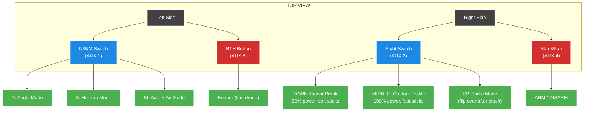

# DJI Remote Controller 3 — Pavo Femto Layout

## Quick Reference

## How to Fly

### Before Takeoff
1. **Choose your environment** with the **Right Switch**:
   - Flying in a room/hallway? → Push **DOWN** (Indoor)
   - Flying in a yard/park? → Push to **MIDDLE** (Outdoor)
2. **Choose your flight mode** with the **N/S/M Switch**:
   - Learning? → Leave on **N** (Angle — auto-levels, can't flip)
   - Intermediate? → Push to **S** (Horizon — auto-levels but allows flips)
   - Advanced? → Push to **M** (Acro — full manual + Air Mode)
3. **Arm the drone**: Press the **Start/Stop** button once. Motors spin up.
4. **Fly!** Raise throttle gently.

### During Flight
- Switch between Angle/Horizon/Acro freely with the **N/S/M switch**.
- **Do NOT change the Right Switch mid-flight** (profile changes are meant for pre-flight).

### After a Crash
- **Upside down?** → Disarm (Start/Stop) → Right Switch **UP** (Turtle Mode) → Push right stick to roll over → Right Switch **DOWN** → Re-arm
- **Lost the drone?** → Press **RTH Button** → Listen for beeping

## Profile Comparison

| | Indoor (Right Switch DOWN) | Outdoor (Right Switch MIDDLE) |
|:---|:---|:---|
| Motor Power | 50% (gentle) | 100% (full) |
| Stick Expo | 55 (very soft center) | 30 (responsive) |
| Super Rate | 40 (slow rotation) | 70 (fast rotation) |
| PID Gains | Factory indoor tune | Boosted for wind |
| Best For | Living room, hallways | Yard, park, field |
