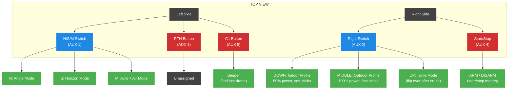

# DJI Remote Controller 3 — Pavo Femto Layout

## Quick Reference

## How to Fly

### Before Takeoff
1. **Choose environment** — Right Switch **DOWN** (indoor) or **MIDDLE** (outdoor)
2. **Choose flight mode** — N/S/M to **N** (Angle for learning)
3. **Arm** — Press **Start/Stop**. Motors spin up.
4. **Fly!** Raise throttle gently.

### LED Colors
| LED Color | Meaning |
|:---|:---|
| 🟠 Orange | Disarmed |
| 🟢 Green | Indoor + Angle Mode |
| 🔵 Blue | Indoor + Horizon Mode |
| 🟡 Yellow | Outdoor Mode (any flight mode) |
| 🔴 Flashing | Low battery — land now! |

### After a Crash
- **Upside down?** → Disarm → Right Switch **UP** (Turtle) → push stick to roll → switch **DOWN** → re-arm
- **Lost the drone?** → Press **C1** → listen for beeping

## Profile Comparison

| | Indoor (Switch DOWN) | Outdoor (Switch MID) |
|:---|:---|:---|
| Motor Power | 50% | 100% |
| Stick Expo | 55 (soft) | 30 (snappy) |
| Super Rate | 40 (slow) | 70 (fast) |
| Best For | Living room, hallways | Yard, park, field |
